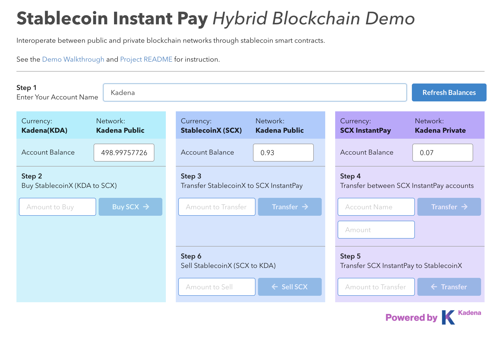

# Stablecoin Instant Pay (Kadena Hybrid Blockchain Demo)

   Stablecoin Instant Pay is a Kadena hybrid blockchain platform which allows token transfers between Kadena Public Network (Testnet) and Kadena Private Network (Kuro). Visit our demo [here](https://hybrid.chainweb.com)

## Token Descriptions  
  - **Kadena (KDA)**: the native cryptocurrency for the Kadena Public network.
  - **StablecoinX (SCX)**: a stablecoin which trades 1:1 with KDA on the public network.
  - **SCX InstantPay**: token used for instant transaction settlement on the private network.

## Requirements
 - Install [Chainweaver Wallet](https://www.kadena.io/chainweaver)
 - A KDA account on Kadena Testnet with balance. (Visit [here](https://faucet.testnet.chainweb.com/) to receive KDA)

## Getting Started
  1. Install [Chainweaver Wallet](https://www.kadena.io/chainweaver)
  2. Open Chainweaver and go to Settings > Network. Click on `Create New Network`.
  3. Name the network as `Kuro` and add the following nodes:
    <ul><li>34.204.71.247:9002</li>
      <li>54.166.153.21:9000</li>
      <li>54.146.43.204:9001</li>
      <li>54.164.36.85:9003</li></ul>
  4. Visit the [Demo Website](http://hybrid.chainweb.com/)
  5. Enter your Kadena Testnet Account name and click on `Refresh Balances`.

## Functionality
#### Buy StablecoinX(SCX) with KDA
 1. Set your network to **Testnet** on chainweaver.
 2. Input amount at Step 2.
 3. Sign transaction and wait 1~2 minutes to clear. Click on `Refresh Balances` to check your balance.
#### Transfer StablecoinX(SCX) to SCX InstantPay
 1. Set your network to **Testnet** on chainweaver.
 2. Input amount at Step 3.
 3. Sign transaction and wait 1~2 minutes to clear. Click on `Refresh Balances` to check your balance.
#### Transfer your balances between SCX InstantPay accounts
 1. Set your network to **Kuro** on chainweaver.
 2. Input account name and amount at Step 4.
 3. Sign transaction and click on `Refresh Balances` to check your balance instantly.
#### Transfer SCX InstantPay to StablecoinX(SCX)
 1. Set your network to **Kuro** on chainweaver.
 2. Input amount at Step 5.
 3. Sign transaction and click on `Refresh Balances` to check your balance instantly.
#### Sell StablecoinX(SCX) for KDA
 1. Set your network to **Testnet** on chainweaver.
 2. Input amount at Step 6.
 3. Sign transaction and wait 1~2 minutes to clear. Click on `Refresh Balances` to check your balance.
